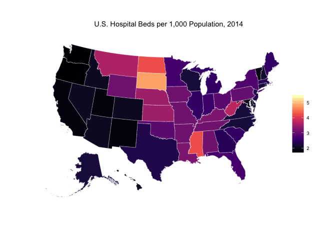

<!-- README.md is generated from README.Rmd. Please edit that file -->
About
=====

The `hospitals` package contains hospital related data. So far it contains the following dataset(s):

-   `hospitals::beds_state`: State-year level hospital beds per 1,000 population. Source: [Hospital Beds per 1,000 Population by Ownership Type, 1999--2014](http://kff.org/other/state-indicator/beds-by-ownership/)

Installation
============

``` r
# install.packages("devtools")
devtools::install_github("jjchern/hospitals")

# To uninstall the package, use:
# remove.packages("hospitals")
```

Usage
=====

``` r
library(dplyr, warn.conflicts = FALSE)
hospitals::beds_state
#> Source: local data frame [816 x 8]
#> 
#>     fips  usps   state  year for-profit non-profit state/local government
#>    (int) (chr)   (chr) (chr)      (dbl)      (dbl)                  (dbl)
#> 1      1    AL Alabama  1999        0.7        1.4                    1.6
#> 2      1    AL Alabama  2000        0.7        1.4                    1.5
#> 3      1    AL Alabama  2001        0.8        1.4                    1.5
#> 4      1    AL Alabama  2002        0.8        1.4                    1.4
#> 5      1    AL Alabama  2003        0.8        1.4                    1.3
#> 6      1    AL Alabama  2004        0.8        1.3                    1.2
#> 7      1    AL Alabama  2005        0.8        1.3                    0.4
#> 8      1    AL Alabama  2006        0.9        0.9                    1.5
#> 9      1    AL Alabama  2007        0.9        0.9                    1.5
#> 10     1    AL Alabama  2008        0.9        0.9                    1.5
#> ..   ...   ...     ...   ...        ...        ...                    ...
#> Variables not shown: total (dbl)

hospitals::beds_state %>% 
        filter(year == 2014) %>% 
        mutate(fips = sprintf("%02d", fips)) -> beds_2014
beds_2014
#> Source: local data frame [51 x 8]
#> 
#>     fips  usps                state  year for-profit non-profit
#>    (chr) (chr)                (chr) (chr)      (dbl)      (dbl)
#> 1     01    AL              Alabama  2014        0.8        0.8
#> 2     02    AK               Alaska  2014        0.3        1.6
#> 3     04    AZ              Arizona  2014        0.4        1.5
#> 4     05    AR             Arkansas  2014        0.7        2.1
#> 5     06    CA           California  2014        0.3        1.2
#> 6     08    CO             Colorado  2014        0.4        1.2
#> 7     09    CT          Connecticut  2014        0.0        2.1
#> 8     10    DE             Delaware  2014        0.0        2.2
#> 9     11    DC District of Columbia  2014        0.9        4.4
#> 10    12    FL              Florida  2014        1.0        1.3
#> ..   ...   ...                  ...   ...        ...        ...
#> Variables not shown: state/local government (dbl), total (dbl)

usmapdata::state %>% 
        left_join(beds_2014, by = c("id" = "fips")) -> beds_2014 

library(ggplot2)
ggplot() +
  geom_map(data = beds_2014, map = beds_2014,
           aes(x = long, y = lat, map_id = id, fill = total),
           colour = alpha("white", 0.5), size=0.2) +
  coord_map("albers", lat0 = 30, lat1 = 40) +
  viridis::scale_fill_viridis(option = "A") +
  ggtitle("U.S. Hospital Beds per 1,000 Population, 2014") +
  ggthemes::theme_map() +
  theme(legend.position = c(.85, .3),
        legend.title=element_blank())
```


